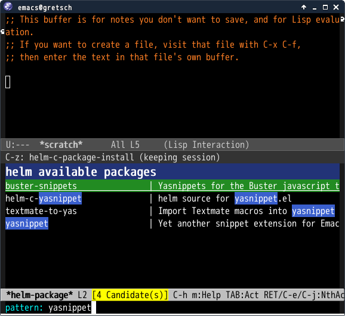

# This Package is Deprecated

## helm-package.el

`helm-package.el` provides command which show available packages and
installed packages with helm-interface .

helm implements the feature same as this package(`helm-list-elisp-packages`).
You should it instead of this package if you use newer `helm`.

## Screenshot




## Requirements

* helm 1.7.7 or higher


## Basic Usage

#### helm-package

Show available packages and installed packages. Action is installing/updating
selected packages.

Refresh packages list if you use prefix argument(`C-u`).

#### Persistent Action

Show package detail.


## Sample Configuration

```lisp
(require 'helm-config)
(require 'helm-package)

(add-to-list 'package-archives '("melpa" . "https://melpa.org/packages/") t)
```
